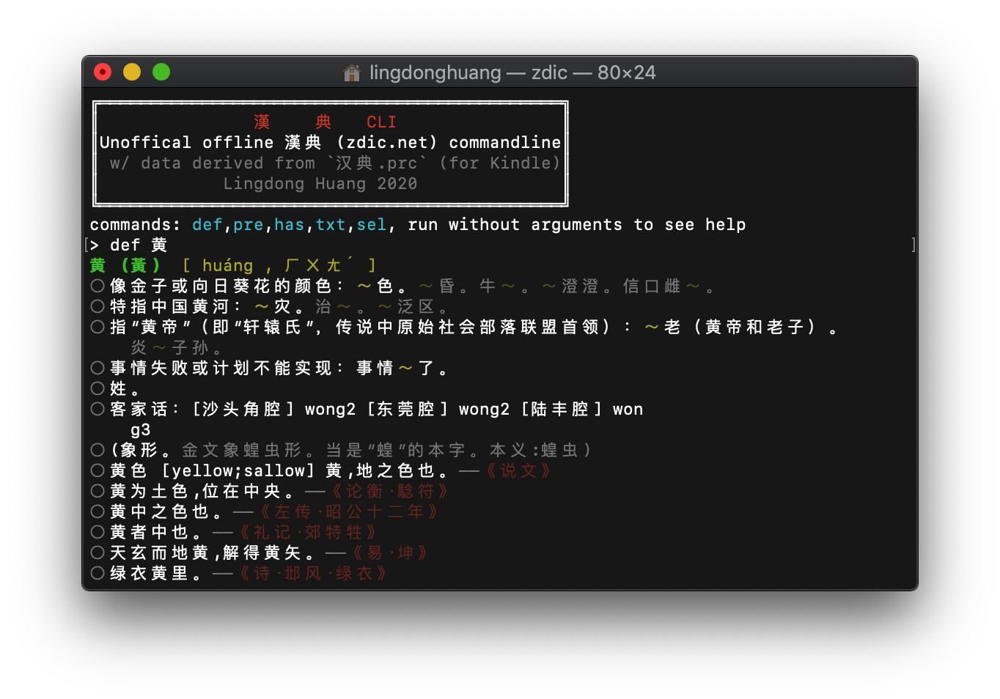
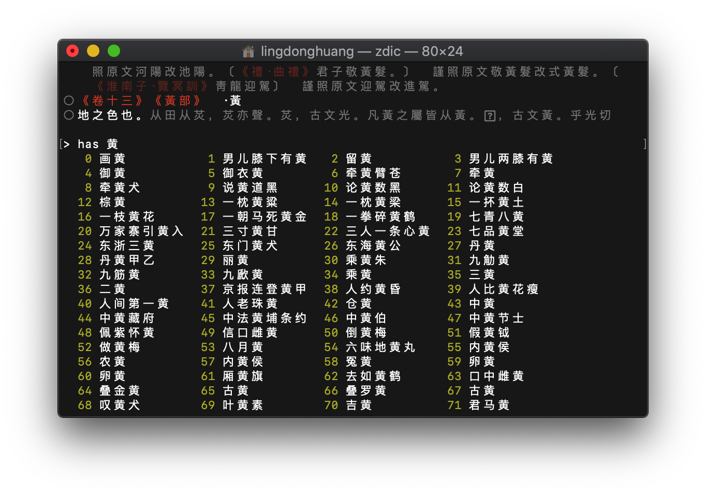
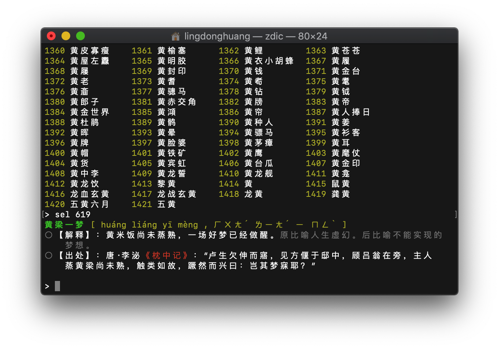
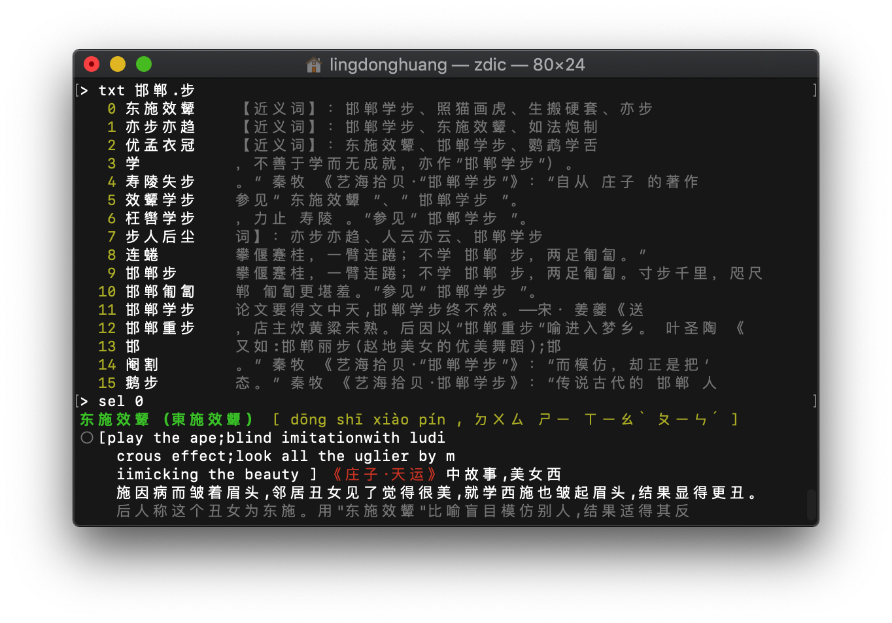

# zdic-cli

An alternative, offline, regex-supporting, command-line interface to [zdic (漢典)](https://zdic.net), featuring:

- No internet connection required
- Full text search with regex: a command for finding characters/phrases in body text of definitions.
- Colorful text for highlighting entries








## Downloads

Standalone version available for windows, mac and linux. Please refer to the [Releases](https://github.com/LingDong-/zdic-cli/releases) page.

## Usage

zdic-cli runs as a REPL loop, and there are 5 types of commands you can enter:

```
def 甲        display entry for 甲
pre 甲        list words that starts with 甲
has 甲 乙 ... list words that contains 甲 and 乙 ...
txt 甲        list words whose full entry text contains 甲 (regex supported)
sel n         display entry at previously returned list index n
```

`def` is probably the most common one for simply looking up characters/words. `pre` `has` `txt` will return an enumerated list listing all eligible entries, and `sel 0`/`sel 1`/`sel n` can be used to select from the list.


## Development setup

**This section is for compiling from source (and is somewhat complex), if you just would like to use the software, please check out the [Releases](https://github.com/LingDong-/zdic-cli/releases) page.**

### Dependencies

- node.js/npm
- python2. Tested on 2.7. It has to be python 2 instead of 3 because much of the data-processing work were done way back in a time when 2 was the norm. Sorry folks, but if you're a python3 purist feel free to send a PR!
- pkg (optional, to build standalone binaries for multiple platforms) `npm install -g pkg`

### Downloading and compiling the dictionary files

This repo does not contain the dictionary files themselves as they're too large. Instead, a shell script (`setup.sh`) is provided to automate the process:

- Automatically download the original Kindle dictionary format (.PRC) from the internet. The download link hardcoded in `setup.sh` might fail in the future, in which case a google search for `汉典.prc` should yield alternative resources.
- Automatically download a python library (kroo/mobi-python) for parsing mobi files. A rather old library and have some oddities, a find-and-replace script will be automatically run to patch some glitches in the source code :P
- `python/to_txt.py` is run to extract a raw `txt` file from the kindle format `prc`.
- `phthon/to_json.py` is run to generate a directory of `json` files from the `txt` to make lookup and formatting more efficient.

Run the shell script with:

```
sh setup.sh
```

At this point you'll have `zdic.prc`, `zdic.txt` and directory `zdic_json/`. Only `zdic_json` is needed, so if everything went well with the script, you can freely delete the other two and gain some 700MB of free space :)

### Compiling the binary

At this point you can also run the software by simply doing:

```
node index.js
```

You can also package it into a binary using

```
pkg .
```

provided you have the node and pkg dependencies installed.

Tip: to run the software by typing `zdic` anywhere, you can symlink it to `/user/bin`, e.g.

```
ln -s /user/bin/zdic path/to/zdic-cli/zdic-cli
```

## Disclaimers

Not affiliated with [zdic.net](https://www.zdic.net/), blah, blah...

MIT License only applies to the source code in this repo, the copyright of the text of the dictionary entries (not included in this repo) belongs to original author(s), blah, blah...
